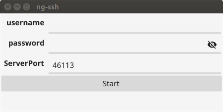
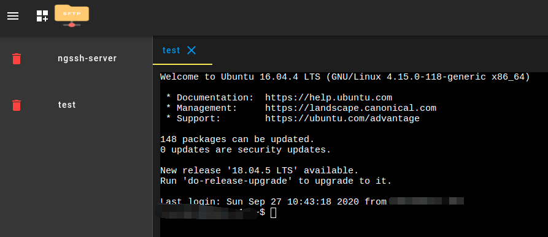

#### ng-ssh [中文](./README_zh-cn.md)

>**Introduction**
>
>>The web version of ssh-client supports sftp to browse files.
>>
>>Two versions of ng-ssh and ng-ssh-pro are provided for different scenarios.
>>
>>The ng-ssh version can only be downloaded for current LAN users.
>>
>>If you want to use it across networks, you can download ng-ssh-pro to provide network penetration.
>
>


**ng-ssh usage documentation**

>   Provides two startup methods: command line and gui interface.
>
>   **Command mode start**
>
>   >   Command description:
>   >
>   >   ```
>   >   ng-ssh -h
>   >   ng-ssh
>   >   
>   >   Usage:
>   >     ng-ssh [flags]
>   >     ng-ssh [command]
>   >   
>   >   Available Commands:
>   >     help        Help about any command
>   >     version     Print the version number of auth_client
>   >   
>   >   Flags:
>   >     -a, --address string    address to listen on (default "0.0.0.0")
>   >     -h, --help              help for ng-ssh
>   >         --password string   password for verify whether you have permission to use ng-ssh, default(admin) (default "admin")
>   >     -p, --port int          port to listen on (default 20019)
>   >         --username string   username for verify whether you have permission to use ng-ssh, default(admin) (default "admin")
>   >   
>   >   ```
>   >
>   >   parameter:
>   >
>   >   ```
>   >   -p: Specify the port on which the service runs. The default is 20019.
>   >   
>   >   --username, --password :Specify login account and password, both are admin by default.
>   >   ```
>   >
>   >   After starting, access the service through the address: `http://localhost:<port>`.
>
>   **gui start**
>
>   >   Double-click `ng-ssh-gui` as shown below:
>   >
>   >   
>   >
>   >   You can also change the login user, password and service port. Click the "Start" button to start the service, the interface will disappear after the service starts successfully. Login: `http://localhost:<port>` to access the service.
>   >
>   >
>
>


#### ng-ssh service usage

>Visit: `http://localhost:<port>`, log in with account and password.
>
>
>
>
>
>**Add ssh configuration**
>
>>Click the button below:
>>
>>
>>
>>Fill in the configuration information:
>>
>>
>>
>>
>>
>>Click on the ssh configuration created in the sidebar to open an ssh connection:
>>
>>
>>
>>
>
>**Access files via sftp**
>
>>Click the button below to open sftp:
>>
>>
>>
>>Click the corresponding ssh configuration in the sidebar to browse the corresponding files:
>>
>>
>>
>>
>
>


#### ng-ssh-pro usage document

>To provide network penetration function, you need to register an account at `www.wl119.club`, and use the registered account to start ng-ssh-pro.
>
>Provides two startup methods: command line and gui interface.
>
>**Command mode start**
>
>>Command description:
>>
>>```
>>ng-ssh-pro -h                 
>>ng-ssh-pro                    
>>                              
>>Usage:                        
>>  ng-ssh-pro [flags]          
>>  ng-ssh-pro [command]        
>>
>>Available Commands:
>>  help        Help about any command
>>  version     Print the version number of auth_client
>>
>>Flags:
>>  -h, --help                    help for ng-ssh-pro
>>      --server-address string   server address, defalut: www.wl119.club:3443 (default "www.wl119.club:3443")
>>  -t, --token string            the token allocated by the system is obtained by logging in to the registered account websit
>>
>>Use "ng-ssh-pro [command] --help" for more information about a command.
>>
>>```
>>
>>parameter:
>>
>>```
>>-t: Specify token information
>>```
>>
>>To obtain the token, log in to `www.wl119.club` with a registered account, and you can see the token in the "User Information":
>>
>>
>>
>>
>
>**gui mode start**
>
>>   Double-click `ng-ssh-pro-gui`, as shown below:
>>
>>   
>>
>>   Enter the registered account information, click "Login" to start ng-ssh-pro, the window disappears after the start is successful.
>
>

#### ng-ssh-pro service usage

>Log in to `www.wl119.club` with the registered account, you can see the launched ng-ssh-pro, click it to jump to the ng-ssh interface.
>
>
>
>The usage is the same as ng-ssh, please see "ng-ssh service usage".
>
>


