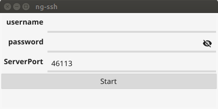
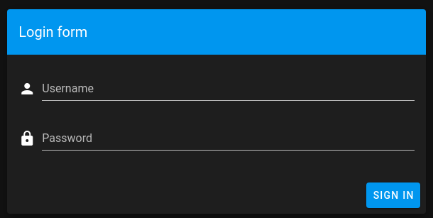
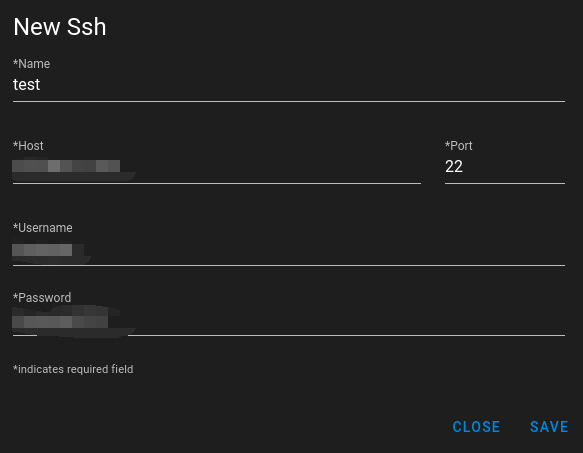
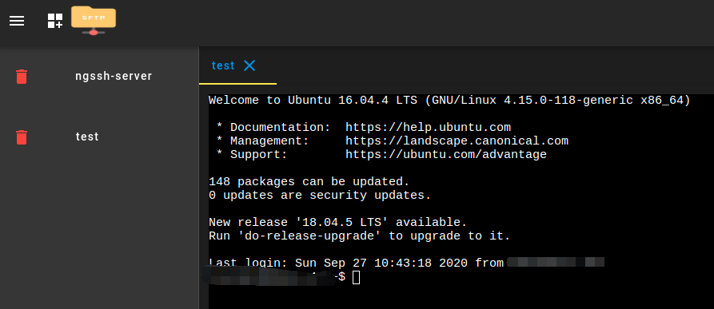
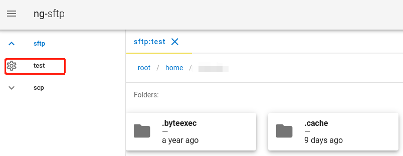

#### ng-ssh

>**简介**
>
>>web版本的ssh-client，支持sftp浏览文件。
>>
>>针对不同场景提供两个版本ng-ssh和ng-ssh-pro。
>>
>>仅当前局域网内使用可以下载ng-ssh版本。
>>
>>如果想跨网络使用可以下载ng-ssh-pro，提供网络穿透功能。
>
>

**ng-ssh使用文档**

>   提供两个启动方式: 命令行和gui界面。
>
>   **命令方式启动**
>
>   >   命令说明:
>   >
>   >   ```
>   >   ng-ssh -h
>   >   ng-ssh
>   >   
>   >   Usage:
>   >     ng-ssh [flags]
>   >     ng-ssh [command]
>   >   
>   >   Available Commands:
>   >     help        Help about any command
>   >     version     Print the version number of auth_client
>   >   
>   >   Flags:
>   >     -a, --address string    address to listen on (default "0.0.0.0")
>   >     -h, --help              help for ng-ssh
>   >         --password string   password for verify whether you have permission to use ng-ssh, default(admin) (default "admin")
>   >     -p, --port int          port to listen on (default 20019)
>   >         --username string   username for verify whether you have permission to use ng-ssh, default(admin) (default "admin")
>   >   
>   >   ```
>   >
>   >   参数:
>   >
>   >   ```
>   >   -p 指定服务运行的端口，默认20019。
>   >   --username, --password 指定登录帐号和密码，默认都为admin。
>   >   ```
>   >
>   >   启动后，通过地址:`http://localhost:<port>`，访问服务。
>
>   **gui方式启动**
>
>   >   双击`ng-ssh-gui`，如下所示:
>   >
>   >   
>   >
>   >   同样可以更改登录的用户，密码和服务的端口。点击"Start"按钮启动服务，服务启动成功后界面会消失。登录:`http://localhost:<port>`访问服务。
>   >
>   >
>
>

#### ng-ssh服务使用

>访问: `http://localhost:<port>`，使用帐号和密码登录。
>
>
>
>
>
>**添加ssh配置**
>
>>点击下面按钮:
>>
>>
>>
>>填写配置信息:
>>
>>
>>
>>
>>
>>点击侧栏中创建的ssh配置开启一个ssh连接:
>>
>>
>>
>>
>
>**通过sftp访问文件**
>
>>点击下面按钮打开sftp:
>>
>>
>>
>>点击侧栏相应的ssh配置，可以浏览相应的文件:
>>
>>
>>
>>
>
>

#### ng-ssh-pro使用文档

>由于提供网络穿透功能，需要到`www.wl119.club`注册一个帐号，使用注册的帐号启动ng-ssh-pro。
>
>提供两个启动方式: 命令行和gui界面。
>
>**命令方式启动**
>
>>命令说明:
>>
>>```
>>ng-ssh-pro -h                 
>>ng-ssh-pro                    
>>                              
>>Usage:                        
>>  ng-ssh-pro [flags]          
>>  ng-ssh-pro [command]        
>>
>>Available Commands:
>>  help        Help about any command
>>  version     Print the version number of auth_client
>>
>>Flags:
>>  -h, --help                    help for ng-ssh-pro
>>      --server-address string   server address, defalut: www.wl119.club:3443 (default "www.wl119.club:3443")
>>  -t, --token string            the token allocated by the system is obtained by logging in to the registered account websit
>>
>>Use "ng-ssh-pro [command] --help" for more information about a command.
>>
>>```
>>
>>参数:
>>
>>```
>>-t 指定token信息
>>```
>>
>>获取token方式，使用注册帐号登录`www.wl119.club`，在"用户信息"中可以看到Token:
>>
>>
>>
>>
>
>**gui方式启动**
>
>>   双击`ng-ssh-pro-gui`，如下所示:
>>
>>   
>>
>>   输入注册的帐号信息，点击"Login"启动ng-ssh-pro，启动成功后窗口消失。
>
>

#### ng-ssh-pro服务使用

>使用注册的帐号登录`www.wl119.club`可以看到启动的ng-ssh-pro，点击就会跳转到ng-ssh的界面。
>
>
>
>使用方式和ng-ssh一致，请看"ng-ssh服务使用"。
>
>


